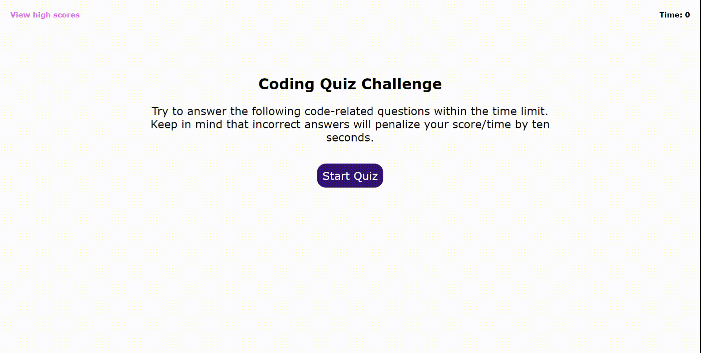

# Code Quiz

Build a timed coding quiz with multiple-choice questions.

---

## Table of Content

- [Quiz Layout](#quiz-layout)
  - [Starting Quiz Page](#start-page)
  - [Questions](#questions-pages)
  - [Score Page](#score-page)
  - [View High Scores](#high-scores)
- [Screenshot](#screenshot)
- [Page Link](#page-link)

---

## Quiz Layout

The quiz layout is separated into parts/pages: starting quiz page, questions, score page, and the view high scores page.

### Starting Quiz Page

The starting quiz page contains the heading "Coding Quiz Challenge" with a description about the rules for the quiz and a start quiz button. Pressing the start quiz button will start the timer at 75 seconds and transfer from the starting page to the first question page. Additionally, there is a view high scores at the top the starting the quiz that when press will lead to the high scores page.

### Questions

There are 5 question pages with a question and 4 choices on each page. Pressing one of the choices will lead to next question page with the last question going to the scoring page. After anwsering a question, a statement at the bottom of the next page will tell the user if he/she has gotten the question correct. Answering the question wrong will result in subtracting 10 seconds from the timer. Like the starting page, there is view high scores link at the top of questions page that will lead to the high scores page. Also, there is timer at the top of page to keep track of how much time is left.

### Score Page

The scoring page is last page of the quiz where it tells the user his/her final score. The final score is the time leftover from completing the quiz. There is a submission where the user can save their score with their initials and store it into the high score list. Like the previous pages, there is a high scores link and leftover time at the top of the page.

### View High Scores

The high scores page has a list of the high scores starting from the greatest to the least score. If the local storage has a record of high scores, the high scores list will be updated with the recorded score when the webpage is loaded. Additionally, the timer will be paused when the page is popup during the quiz.
Lastly, there are two buttons "Go Back" and "Clear High Scores". Pressing "Go Back" will go back to the page where the view high scores was click on and will resume the timer if it was during the middle of quiz. Pressing "Clear High Scores" will clear the high scores list and remove them local storage as well.

---

## Screenshot

---

## Page Link

Link: <a href="https://ptran77.github.io/code-quiz/">https://ptran77.github.io/code-quiz/</a>
